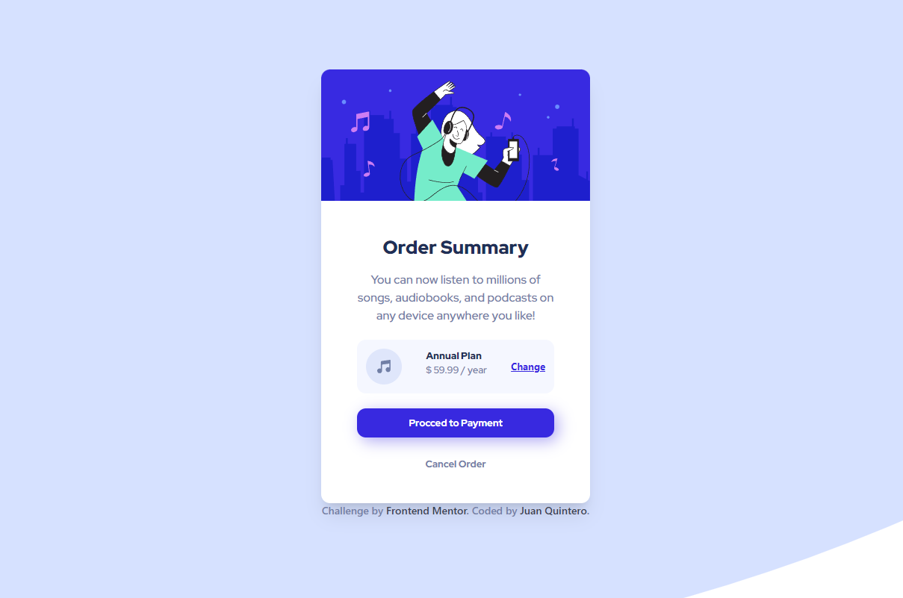

# Frontend Mentor - Order summary card solution

This is a solution to the [Order summary card challenge on Frontend Mentor](https://www.frontendmentor.io/challenges/order-summary-component-QlPmajDUj). Frontend Mentor challenges help you improve your coding skills by building realistic projects. 

## Table of contents

- [Overview](#overview)
  - [The challenge](#the-challenge)
  - [Screenshot](#screenshot)
  - [Links](#links)
- [My process](#my-process)
  - [Built with](#built-with)
  - [Useful resources](#useful-resources)
- [Author](#author)

**Note: Delete this note and update the table of contents based on what sections you keep.**

## Overview

### The challenge

Users should be able to:

- See hover states for interactive elements

### Screenshot

### Links

- Solution URL: [https://www.frontendmentor.io/challenges/order-summary-component-QlPmajDUj/hub/order-summary-component-2VVS1t_uO/solutions](https://www.frontendmentor.io/challenges/order-summary-component-QlPmajDUj/hub/order-summary-component-2VVS1t_uO/solutions)

Live Site URL: [https://juanpq26.github.io/order-summary-component/](https://juanpq26.github.io/order-summary-component/)

## My process

### Built with

- Semantic HTML5 markup
- Sass CSS preprocessor
- Flexbox
- Tailwind CSs
- [Vue.js](https://vuejs.org/)

### Useful resources

- [MDN Web Docs](https://developer.mozilla.org/es/docs/Web/CSS/CSS_Flexible_Box_Layout/Basic_Concepts_of_Flexbox) - This helped me to use Flexbox.
- [Vue.js Docs](https://vuejs.org/v2/guide/) - This helped me to use Vue.js.

## Author

- Frontend Mentor - [@JuanPQ26](https://www.frontendmentor.io/profile/JuanPQ26)
- Twitter - [@juanpq2003](https://www.twitter.com/juanpq2003)
